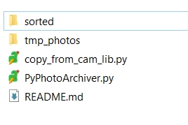
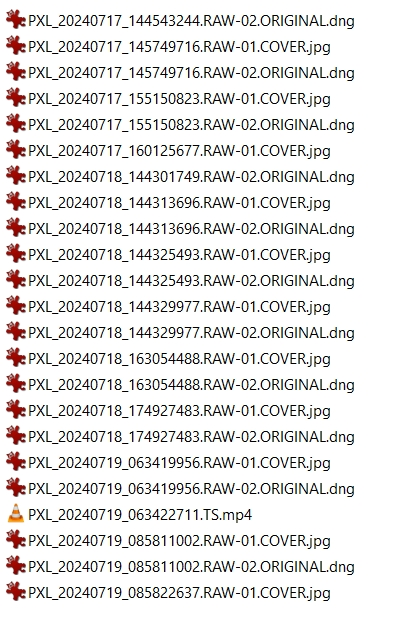
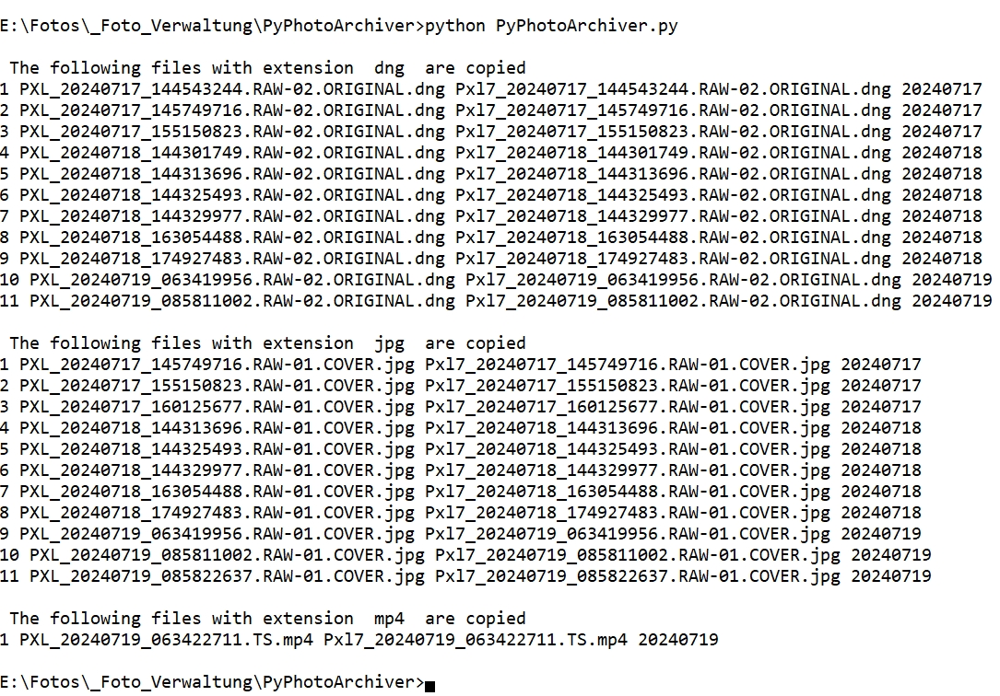
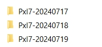
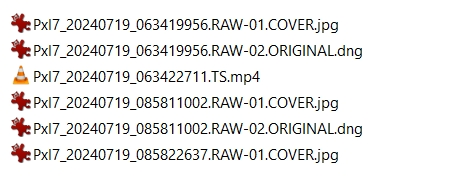

# PyPhotoArchiver

Executing PyPhotoArchiver (with "python PyPhotoArchiver.py") will take the files in the folder *tmp_photos* and copy and sort them into folders arranged by days being located in the folder *sorted*.

To use it you need Python, see https://www.python.org/, on your system and exifread, which you may download with "pip install exifread". In the directory where you install the 2 Python files you then have to create 2 folders, i.e.

* tmp_photos and
* sorted.

Finally your directory PyPhotoArchiver should look like

Before using the archiver, you should adapt the Python code in *PyPhotoArchiver.py* and define an abbreviation that suits your camera. For example I set for my Pixel 7 phone

* camera_abrev = 'Pxl7' and
* iskip = 3 (the name of the photo files is PXL_20240714_111106642, so I skip the first 3 characters and replace them by Pxl7).

The workflow is the following

1. Copy all photos into folder tmp_photos.
2. Set the two paramters camera_abrev and iskip to suit your camera
3. Run the command python PyPhotoArchiver.py

## Example (Pixel 7 files)

After copying my photo files into the folder tmp_photos it looks like

Running the command PyPhotoArchiver.py and you should see

you should have in directory sorted

and in directory Pxl7-20240719

Typically, I then copy these day folders into my arcive, i.e. a folder 2024, for this year.
